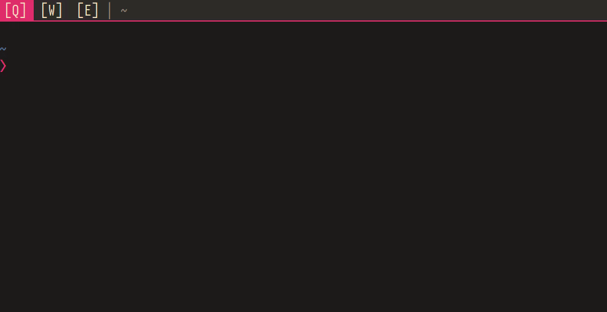

i3wsr - i3 workspace renamer
======
`i3wsr` is a small program that uses [I3's](https://i3wm.org/) [IPC Interface](https://i3wm.org/docs/ipc.html)
to change the name of a workspace based on its contents.

## Details

The chosen name for a workspace is a composite of the `WM_CLASS` X11 window
property for each window in a workspace. In action it would look something like this:



## Installation
[Rust](https://www.rust-lang.org/en-US/), and [Cargo](http://doc.crates.io/) is
required, and `i3wsr` can be installed using cargo like so:

```sh
cargo install i3wsr
```

Or alternatively, you can build a release binary,

```sh
cargo build --release
```

Then place the built binary, located at `target/release/i3wsr`, somewhere on your `$path`.

## Usage
Just launch the program and it'll listen for events if you are running I3.
Another option is to put something like this in your i3 config

```
exec_always --no-startup-id exec i3wsr
```

provided `i3wsr` is on your `$path`

## Configuration

This program depends on numbered workspaces, since we're constantly changing the
workspace name. So your I3 configuration need to reflect this:

```
bindsym $mod+1 workspace number 1
```

If you're like me and don't necessarily bind your workspaces to only numbers, or
you want to keep a part of the name constant you can do like this:

```
bindsym $mod+q workspace number 1:[Q]
```

This way the workspace would look something like this when it gets changed:

```
1:[Q] Emacs|Firefox
```
You can take this a bit further by using a bar that trims the workspace number and be left with only
```
[Q] Emacs|Firefox
```

## Attribution
This program would not be possible without
[i3ipc-rs](https://github.com/tmerr/i3ipc-rs), a rust library for controlling
i3-wm through its IPC interface and
[rust-xcb](https://github.com/rtbo/rust-xcb), a set of rust bindings and
wrappers for [XCB](http://xcb.freedesktop.org/)

Also I was made aware deep in development of
[i3-renameworkspaces](https://github.com/mh21/i3-renameworkspaces), a perl
program that does almost exactly what this does, so you might want to check that
out also.
